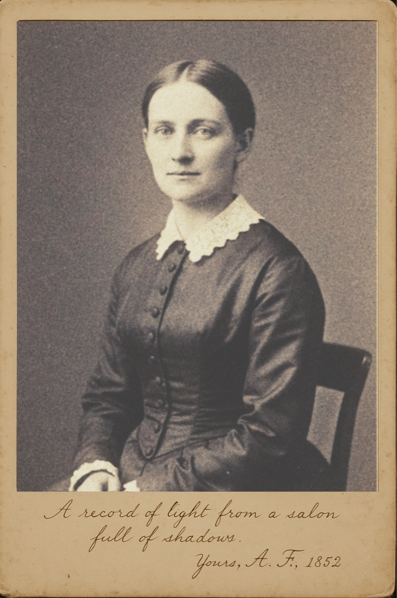

# The Finch-Bennet Correspondence

Among the most significant revelations from the discovery of the Bennet Archive is the extensive, two-decade correspondence between Bradbury Bennet and Mrs. Adelaide Finch of London. While Bennet's journal offers a window into his own mind, these letters reveal his sole intellectual and emotional sanctuary—a relationship of profound respect and shared understanding with a woman he considered a brilliant anomaly in an age of credulity.

### An Unlikely Acquaintance

Their acquaintance began not in a Somerset drawing-room, but in the heart of London's pseudoscientific theatre. In the early 1840s, Bennet attended a public lecture on mesmerism by the celebrated Dr. Alistair Finch, Adelaide's husband. Bennet went as a sceptic, intending only to observe and catalogue the methods of a charlatan. Following the event, he was briefly introduced to Mrs. Finch.

He expected, as he later noted in his journal, to meet "a credulous acolyte." Instead, he discovered a mind of formidable clarity, wit, and quiet, piercing observation. A brief exchange revealed her as a fellow spirit—a melancholic rationalist trapped within the very epicentre of the foolishness he so disdained. This single meeting sparked a correspondence that would become the central pillar of Bennet's later life.

### The Nature of the Bond

Their bond was never a romance in the conventional sense, but a profound intellectual and emotional symbiosis. This was shaped significantly by their twenty-year age difference. Bennet, a man of forty-five at their meeting, saw in the twenty-five-year-old Adelaide not a potential partner, but something far rarer: a brilliant, vulnerable mind whose integrity he felt a duty to protect. He viewed her, in his naturalist's terms, as a "rare and endangered specimen of reason."

Their letters became a shared private world where they could discard the masks their respective lives demanded. They debated philosophy, exchanged pressed flowers and sketches of insects, and shared their private poetry—a vulnerability Bennet allowed himself with no one else. Under an unspoken pact, they rarely mentioned Dr. Finch's work directly, alluding to it only with a shared sense of weariness. For Bennet, Adelaide was his "observer on the ground" in London, providing sharp, often melancholic reports from the world of arts and letters.

### The Society of Night Walkers

Mrs. Finch became the first and most crucial member of what Bennet privately termed his "Society of Night Walkers." She was the "Night Walker of Society," her London salon a metaphorical night of pretence and irrationality which she navigated as a detached observer. Her inscription on the portrait she sent Bennet—*"A record of light from a salon full of shadows"*—perfectly encapsulates this role. Through Bennet, her incisive observations on human folly would later be shared, anonymised, with the society's third member, Mr. Alaric Thorne, completing their epistolary triangle.

### The Portrait as Artefact

  
*The daguerreotype of Mrs. Finch, c. 1852, with her handwritten inscription. Bennet found it a "most remarkable specimen."*

The portrait of Mrs. Finch, sent to Bennet around 1852, is therefore an artefact of immense importance. It represents an act of trust and intimacy, a tangible link in their otherwise disembodied friendship. It stands in stark contrast to Bennet's own deep-seated aversion to being photographed, highlighting the unique space their correspondence occupied in his life. [Read Bennet's journal entry upon receiving the portrait.](../entries/1852-07-03.md)

---
> **Editor's Note:** The Finch-Bennet letters represent one of the most complete epistolary relationships in the archive. Scholars generally agree that their bond, while platonic, was the most significant of Bennet's life. It offers a poignant counter-narrative to the common perception of Bennet as a solitary recluse, revealing a capacity for deep, sustained intellectual and emotional connection. The collection is currently being prepared for a separate scholarly publication. - Dr. E. Reed

---
[Return to Contextual Essays](./index.md) | [Return to the Main Archive](../index.md)
