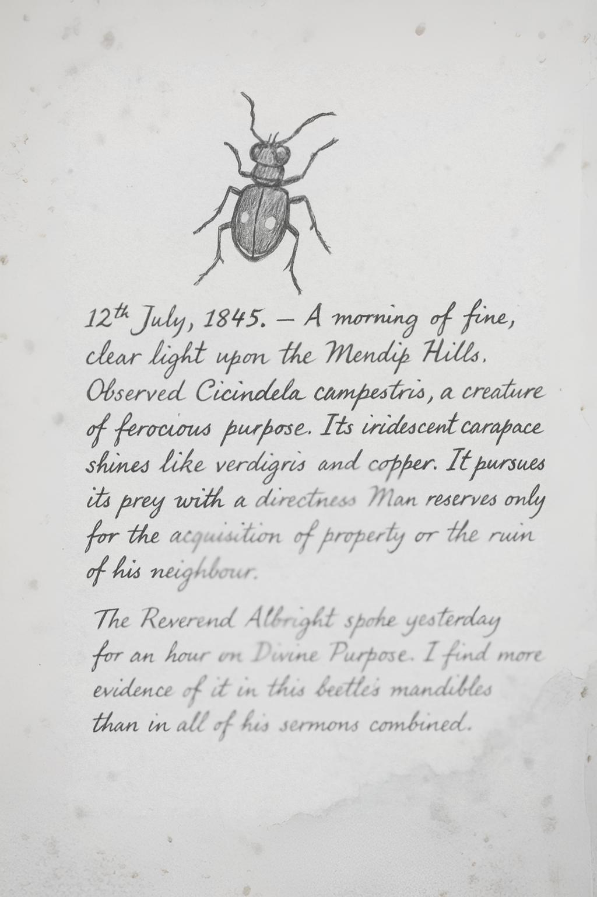

# Gallery of Artefacts

This gallery contains digital reproductions of key artefacts from the Bennet Archive. Due to the fragile nature of the original items, public access is limited to these digital scans.

---

### Portraits

**A Note on the Absence of a Portrait of Bradbury Bennet**
  
*Despite extensive research at The Larches and a search of regional archives, no confirmed portrait or photograph of Bradbury Bennet has been found. This absence is, perhaps, entirely in keeping with the character revealed in his diaries: a man deeply private, skeptical of vanity, and more interested in observing the world than in being observed by it. The signature above, taken from the flyleaf of his 1842 journal, is the most personal artefact of his identity we possess.*

**Mrs. Adelaide Finch (c. 1855)**
  
*Recreated studio portrait of Mrs. Adelaide Finch, a London correspondent of Bennet's. The photograph was enclosed in a letter dated May 1855. Heavily digitally enhanced due to damage.*

### Manuscript Samples

**A Page from the Journal of 1845 (Undergoing Restoration)**
  
*A high-resolution scan of a journal page dated 12th July 1845, showing significant water damage sustained prior to its discovery. The entry details Bennet's observation of a Green Tiger Beetle. Our conservation department is currently working to stabilize the manuscript. This image serves as a record of the artefact's initial condition. [Read the transcription of this entry](entries/1845-07-12.md).*

**Illustration of *Deilephila elpenor* (1852)**
  
*A fine example of Bennet's skill as a naturalist-illustrator. This watercolour and ink drawing corresponds to his journal entry of 11th June 1852. The notes indicate the species, date, and location of the capture. [Read the corresponding journal entry](entries/elephant-hawk-moth.md).*

---
[Return to the Main Archive](index.md)
