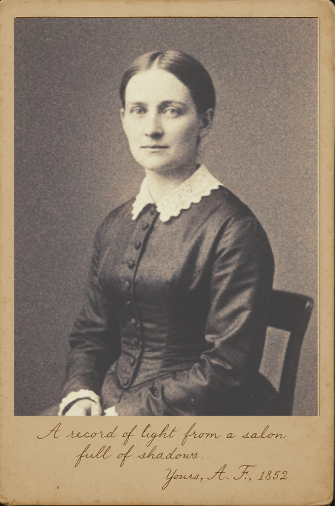

# Gallery of Artefacts

This gallery contains digital reproductions of key artefacts from the Bennet Archive. Due to the fragile nature of the original items, public access is limited to these digital scans.

---

### Portraits

**Bradbury Bennet (c. 1852)**
  
*The only known likeness of Bradbury Bennet, this calotype photograph was taken in Taunton by Mr. Elias Thornecroft of Bath. Bennet, who disdained portraiture as an act of vanity, was persuaded to sit for the photograph by his friend Dr. Henry Caldwell under the pretext that it was for the scientific record of the Somerset Archaeological and Natural History Society. His own journal entry on the matter is characteristically acerbic. [Read the corresponding journal entry](entries/1852-06-08.md).*

**Mrs. Adelaide Finch (c. 1852)**
  
*This albumen print of Adelaide Finch was discovered not with the main journals, but among Bennet's most private papers at The Larches. It is believed she sent it to him in 1852, a stark contrast to his own reluctant sitting. The photograph is mounted on card stock and bears a handwritten inscription in the bottom margin: "A record of light from a salon full of shadows. Yours, A. F., 1852." The quote is a poignant summary of her role as an observer and her intellectual bond with Bennet. [Learn more about the Finch-Bennet correspondence](context/finch-correspondence.md).*

### Manuscript Samples

**A Page from the Journal of 1845 (Undergoing Restoration)**
  
*A high-resolution scan of a journal page dated 12th July 1845, showing significant water damage sustained prior to its discovery. The entry details Bennet's observation of a Green Tiger Beetle. Our conservation department is currently working to stabilize the manuscript. This image serves as a record of the artefact's initial condition. [Read the transcription of this entry](entries/1845-07-12.md).*

**Illustration of *Deilephila elpenor* (1852)**
  
*A fine example of Bennet's skill as a naturalist-illustrator. This watercolour and ink drawing corresponds to his journal entry of 11th June 1852. The notes indicate the species, date, and location of the capture. [Read the corresponding journal entry](entries/elephant-hawk-moth.md).*

---
[Return to the Main Archive](index.md)
